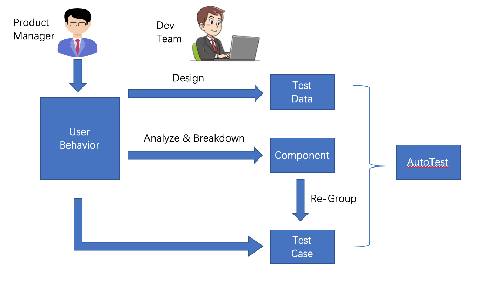

# web-function-test

基于Chromium内核的自动化测试工具，用户只需要定义测试流程和数据，完全不需要代码

##  申明
基于[puppeteer](https://github.com/GoogleChrome/puppeteer)开发的web应用程序自动化测试

还在开发过程，目前只能演示一下到底能干啥。

## 前提
MAC + Node.JS环境，windows没试过也懒得试了

## quick start

安装
```
npm install -g @cic-digital/web-function-test
```

为了方便说明，假设我们的测试对象是github，我们想登陆github，更改status为busy，再取消status

打开命令行工具，找到一个空目录，先初始化测试工具
```
wft init
```

生成example必要的文件
```
wft example
```

注意：wft example 命令无法重复使用，请删除目录下所有文件后从init命令开始做，也不要在现有测试用例目录下执行example命令

等待param.json文件打开，如果没有自动打开，请手动打开./execution/param.json，并在合适的地方输入你的github账号和密码

Every this is fine, just run your test
```
wft run
```
执行完毕后，可以在./output/下找到截图

## what happened

请参考component目录和execution目录下的文件，你只需要定制你的业务逻辑，就可以轻松的自动化测试啦

##  Basic Concept


## how to use it(WIP)
此功能还在开发中
```
wft ui
```

默认使用3000端口，如果端口占用
```
PORT={PORT} wft ui
```
{PORT}换成你希望的端口

在用户界面编辑业务逻辑component和测试用例case
